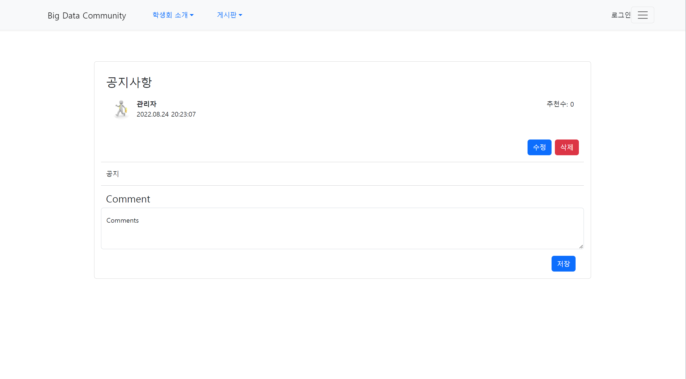

# community-app
React를 기반으로 Spring boot를 이용하여 간단한 커뮤니티 만들기

# 프로젝트 개요
&nbsp;일상 생활속 우리가 모바일이나 PC로 많이 접속하는 커뮤니티. 간단하게 게시판과 정보 등 어렵지 않게 접근할 수 있는 커뮤니티를 구현해보는 프로젝트이다. 교내 정보과학대학 사이트맵이 존재하지만, 각 학부, 전공에 대한 설명이나 공지가 생각보다 적다고 느껴졌다. 그래서 여러 학우들이 접근하기 쉽게 하기 위해 교내 학생회 및 학부 전공 관련 커뮤니티를 제작하는 프로젝트를 선정했다.

## 개발 환경
* Java
> `11.0.16.1`
* Spring boot
> `2.6.9` Gradle Project   
> Lombok   
> Spring Web   
> MySQL Driver   
> H2 Database   
> Spring Data JPA
* IntelliJ
> IDEA Community Edition `2022.2.1`
* React.js
* MySQL Server
> `8.0.30`   
## 실행 요약
&nbsp;IntelliJ를 통해 Spring boot와 react를 실행시켜주어야 실행이 가능하다.   
우선 콘솔 상에서 react 작업 경로로 이동 후
```
cd src/main/frontend
npm start
```
입력을 입력해준다. react가 실행될 때까지 기다린다.   
MySQL Server와 Spring boot를 실행시켜주어 프로젝트를 실행시킨다.

&nbsp;프로젝트 시작 후 실행되는 메인페이지이다. 게시판 박스 안 게시글을 클릭하면 해당 게시글로 넘어가게 route 지정을 해주었다.

```java
  ...
@RestController
@RequestMapping("/api/freeboard")
public class freeBoardController {
    private Integer num_Id=0;
    private Integer commentNum_Id=0;
    @Autowired
    private FreePostRepository fr;
    @GetMapping("")
    public List<FreePost> freeBoard(){
        List<FreePost> free=fr.findAll();
        if(free.size()>0)
            num_Id=free.get(free.size()-1).getId();
        else
            num_Id=0;
        return free;
    }
    ...
```
&nbsp;자유게시판은 /api/freeboard로 데이터를 주고 받아 repository를 통해 react에 쏴주는 형식이다.
```javascript
    ...
    useEffect(() => {
      type.id === "1"
        ? axios.get("http://localhost:8080/api/freeboard").then((response) => {
            setPosts(response.data);
          })
    ...
```
&nbsp;react는 Spring boot와 Database에서 데이터를 주고 받는 repository링크를 받아와 화면 상에 보여준다. 
다른 게시판도 마찬가지로 같은 형식으로 구성되어 있다.


&nbsp;댓글 추가 기능도 마찬가지로 구현되어 있고, 수정 또한 구현되어있다.
